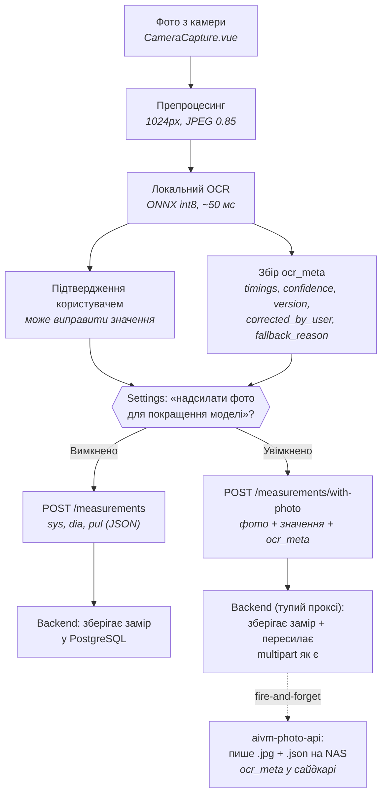

# BP Tracker — план робіт

Єдиний план для всіх частин системи. Технічна документація — у README.md відповідних підпроєктів.

---

## Backend (bptracker-backend)

**Поточний стан:** ASP.NET Core 10, PostgreSQL 16, Serilog + Seq. Local OCR primary, Gemini fallback. Тести покривають OCR-шляхи. Таблиці бази даних мігровано на `timestamptz` з використанням `DateTimeOffset` в C#. Схеми лікування (програми прийому ліків) ізольовані на рівні користувача (`UserId`). Додано API-ендпоінти для управління розкладом та підтвердженням прийому ліків (`/reminders`).

**Tech debt:** див. секцію "Tech Debt" у [bptracker-backend/README.md](./bptracker-backend/README.md).

---

## Frontend (bptracker-frontend)

**Поточний стан:** Vue 3 PWA, Web Share Target для фото з галереї, офлайн-черга для ручних замірів. Впроваджено новий дизайн навігації: нижній асиметричний таб-бар на 2 вкладки ("Дашборд" та "Розклад") з великою кнопкою "Скан" по центру. Додано плаваючу скрол-залежну кнопку налаштувань (`CornerGear`). Сторінки Історії, Призначень та Налаштувань переведені у формат drill-down екранів. Інтегровано нагадування про прийом ліків із відображенням реактивного бейджа пропущених прийомів.

**Заплановано:** —

---

## aivm-photo-api

**Поточний стан:** FastAPI, контейнер на NAS. `/images/upload` — збір датасету; `/images/recognize` — primary OCR (YOLOv8, ~50 мс).

**Заплановано:**
- Лічильник нерозпізнаних фото + ендпоінт для backend (див. розділ ML-донавчання нижче)

---

## bp-ocr-cnn

**Поточний стан:** Модель digit_detector натренована на 20 з 42 фото, end-to-end 100% на існуючому датасеті, розгорнута в проді.

**Заплановано:** див. [bp-ocr-cnn_PLAN.md](./bp-ocr-cnn/bp-ocr-cnn_PLAN.md).

---

## Кросс-системні задачі

### ML-донавчання при накопиченні нерозпізнаних фото

Хочемо напівавтоматизований цикл донавчання моделі коли модель починає помилятись на нових даних (інший тонометр, інша камера, інші умови освітлення).

Запропонована схема:
- aivm-photo-api рахує fail-розпізнавання і користувацькі виправлення (`corrected_by_user: true`).
- При накопиченні ≥N таких випадків — нотифікація користувачу (через backend → frontend).
- Користувач самостійно: скачує фото з NAS, дорозмічує в makesense.ai, перетреновує модель в bp-ocr-cnn, копіює нову модель в aivm-photo-api, redeploy.

Повна автоматизація неможлива через необхідність ручної розмітки нових даних.

**Підзадачі:**
- Лічильник у aivm-photo-api
- Ендпоінт `/admin/unrecognized-count` (або інша форма)
- Перевірка з боку backend (періодична або при кожному запиті)
- Нотифікація користувачу у фронтенді

### GitHub Projects

Завести Projects v2 для координації роботи між чотирма репозиторіями (bptracker-backend, bptracker-frontend, aivm-photo-api, bp-ocr-cnn). Цей PLAN.md може стати master-документом, окремі задачі — issues у відповідних репо.

---

## Архітектура потоку даних

